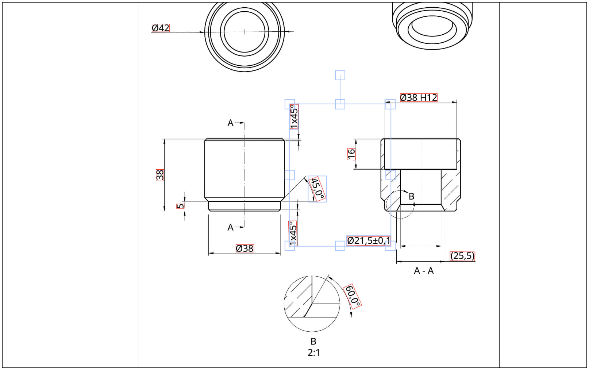

<div align="center">
  
</div>

[](https://www.npmjs.com/package/@dansreis/react-canvas-annotator)
[](https://www.npmjs.com/package/@dansreis/react-canvas-annotator)
[](https://github.com/dansreis/react-canvas-annotator/actions)


# react-canvas-annotator

**Image/Document Annotator Component for React Applications**

Powered by FabricJS canvas at its core, this component empowers users to seamlessly integrate annotations such as bounding boxes, polygons, and points onto images or documents. By exposing canvas interactions, it provides a foundation for constructing larger and more complex components.

[Check out the demo here.](http://localhost:6006)

## Features

- [X] Annotations on images
- [X] Polygon Annotation
- [X] Image zoom and drag
- [ ] Bounding Box Annotation
- [ ] Highlight by ID
- [ ] Categorize annotations with colors and labels



## Installation

To install the package, use the following command:

```sh
npm install @dansreis/react-canvas-annotator
```

## Usage

Here's a basic example of how to use the `react-canvas-annotator` component in a React application:

```javascript
import React, { useRef } from "react";
import Board from "react-canvas-annotator";
import { CanvasObject } from "../types";

const ITEMS: CanvasObject[] = [
  {
    id: "1",
    category: "category1",
    color: "green",
    value: "⌀42",
    coords: [
      { x: 133, y: 460 },
      { x: 206, y: 460 },
      { x: 206, y: 493 },
      { x: 133, y: 493 },
    ],
  },
  {
    id: "2",
    category: "category2",
    color: "green",
    value: "38",
    coords: [
      { x: 150, y: 1064 },
      { x: 182, y: 1064 },
      { x: 182, y: 1111 },
      { x: 150, y: 1111 },
    ],
  },
  {
    id: "3",
    category: "category3",
    color: "green",
    value: "9",
    coords: [
      { x: 235, y: 1207 },
      { x: 266, y: 1207 },
      { x: 266, y: 1226 },
      { x: 235, y: 1226 },
    ],
  },
  // ... other items
];

const App = () => {
  const ref = useRef(null);

  return (
    <div
      style={{
        display: "flex",
        justifyContent: "center",
        alignItems: "center",
        width: "800px",
        height: "500px",
        border: "1px solid black",
      }}
    >
      <Board
        ref={ref}
        image={{ name: "holder-min", src: "holder-min.jpg" }}
        items={ITEMS}
      />
    </div>
  );
};

export default App;
```

## Props

All of the following properties can be defined on the `Board` component:

| Prop               | Type                                            | Description                                                                                       | Default       |
| ------------------ | ----------------------------------------------- | ------------------------------------------------------------------------------------------------- | ------------- |
| `items`            | `CanvasObject[]`                                | Array of annotation objects to be displayed on the canvas.                                        | []            |
| `image`            | `{ name: string; src: string }` *               | Object containing the name and source of the image to be annotated.                               |               |
| `initialStatus`    | `{ draggingEnabled?: boolean; currentZoom?: number; scaleRatio?: number; }` | Initial status settings for dragging, zoom level, and scale ratio.                                | {}            |
| `onResetZoom`      | `() => void`                                    | Callback function to handle zoom reset action.                                                    |               |
| `onZoomChange`     | `(currentZoom: number) => void`                 | Callback function triggered when the zoom level changes.                                          |               |
| `onToggleDragging` | `(currentStatus: boolean) => void`              | Callback function triggered when dragging is toggled.                                             |               |
| `onLoadedImage`    | `({ width, height }: { width: number; height: number; }) => void` | Callback function triggered when the image has been successfully loaded, providing its dimensions. |               |

*(Properties marked with \* are required)*

## Development

To begin developing, run the following commands in the cloned repository:

1. `npm install`
2. `npm run storybook`

Then navigate to [http://localhost:6006/](http://localhost:6006/) and start testing.

See more details in the [contributing guidelines](https://github.com/dansreis/react-canvas-annotator/blob/main/CONTRIBUTING.md).

## Icon Libraries

Consult these icon repositories:

- [Styled Components](https://material.io/tools/icons/)
- [FabricJS](https://github.com/fabricjs/fabric.js)
- [FabricJS-React](https://github.com/asotog/fabricjs-react)

## Contributions

Contributions are welcome! Please see the [contributing guidelines](https://github.com/dansreis/react-canvas-annotator/blob/main/CONTRIBUTING.md) for more information.

## Donations

If you find this project helpful and would like to support its development, please consider buying me a coffee:

<a href="https://www.buymeacoffee.com/dansreis" target="_blank"></a>

## License

MIT © [Daniel Reis](https://github.com/dansreis)

Feel free to collaborate.
